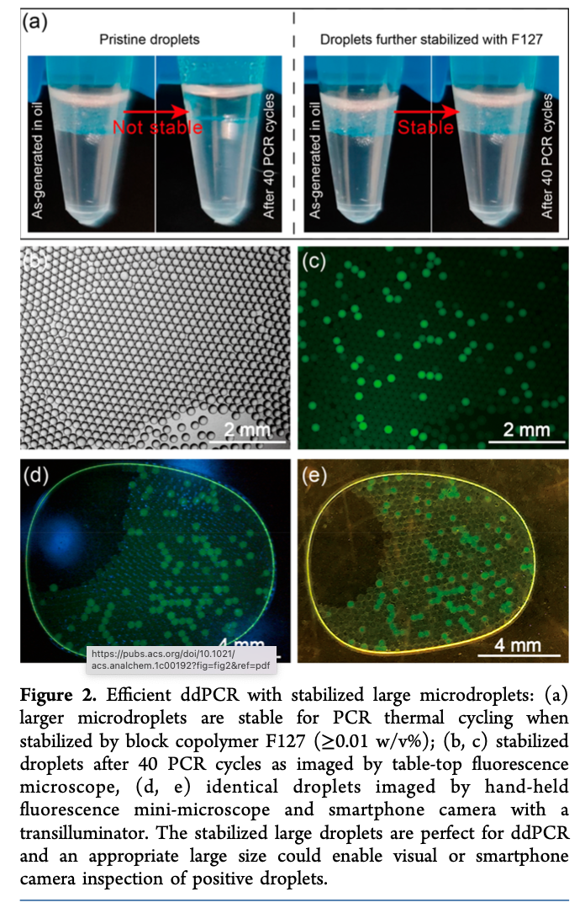

# Working with Images

* Image Capture
* Cleaning Images
* Image Segmentation
* Extracting Data from Images
* Application: Low-Cost point of care device for ddPCR testing.

Chen, L., Yadav, V., Zhang, C., Huo, X., Wang, C., Senapati, S., & Chang, H. C. (2021). Elliptical Pipette Generated Large Microdroplets for POC Visual ddPCR Quantification of Low Viral Load. Analytical Chemistry, 93(16), 6456-6462.

